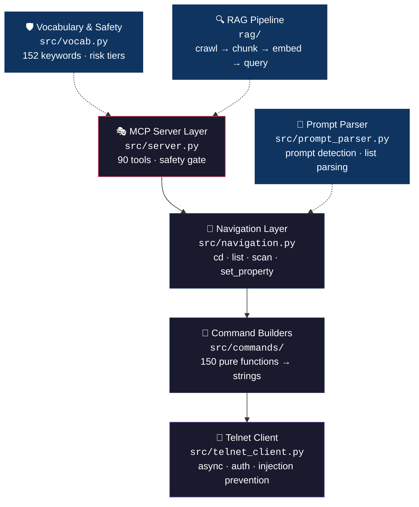
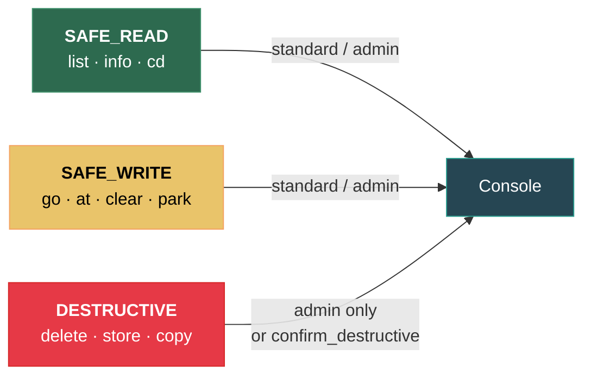

<div align="center">

# GMA2 MCP

[](https://github.com/thisis-romar/ma2-onPC-MCP/actions/workflows/test.yml)


**MCP server for controlling grandMA2 lighting consoles via Telnet.**

Exposes grandMA2 commands as [Model Context Protocol](https://modelcontextprotocol.io/) tools so AI assistants
(Claude Desktop, VS Code, etc.) can operate a lighting console programmatically.

[Quick Start](#quick-start) · [Architecture](#architecture) · [90 MCP Tools](#mcp-tools) · [Safety System](#safety-system) · [RAG Pipeline](#rag-pipeline)

</div>

---

## Quick Start

```bash
# 1. Install
git clone https://github.com/thisis-romar/ma2-onPC-MCP && cd gma2-mcp-telnet
uv sync

# 2. Configure
cp .env.template .env        # then edit with your console IP

# 3. Install git hooks (auto-updates RAG index on every commit)
make install-hooks

# 4. Run
uv run python -m src.server  # starts MCP server (stdio transport)
```

> [!TIP]
> **Semantic search:** Add `GITHUB_MODELS_TOKEN=ghp_...` to `.env`, then run
> `uv run python scripts/rag_ingest.py --provider github` once to rebuild the index with
> real embeddings. The `search_codebase` MCP tool will automatically use semantic ranking
> when the token is present.

## Architecture



> All network I/O is isolated in `telnet_client.py`. Command builders are pure functions that return strings. The navigation layer orchestrates cd/list workflows with parsed telnet feedback.

## Configuration

Create a `.env` file (see `.env.template`):

```env
# grandMA2 Console
GMA_HOST=192.168.1.100     # grandMA2 console IP (required)
GMA_USER=administrator     # default: administrator
GMA_PASSWORD=admin         # default: admin
GMA_PORT=30000             # default: 30000 (30001 = read-only)
GMA_SAFETY_LEVEL=standard  # standard (default), admin, or read-only
LOG_LEVEL=INFO             # default: INFO

# RAG Pipeline (optional)
GITHUB_MODELS_TOKEN=                          # GitHub PAT with models:read scope
RAG_EMBED_MODEL=openai/text-embedding-3-small # embedding model
RAG_EMBED_DIMENSIONS=1536                     # vector dimensions
```

> [!NOTE]
> Get a GitHub PAT with the `models:read` scope at [github.com/settings/tokens](https://github.com/settings/tokens).

| Level | Behavior |
|-------|----------|
| `read-only` | Only `SAFE_READ` commands allowed (`list`, `info`, `cd`) |
| `standard` | `SAFE_READ` + `SAFE_WRITE` allowed; `DESTRUCTIVE` requires `confirm_destructive=True` |
| `admin` | All commands allowed without confirmation |

## MCP Tools

The server exposes **90 tools** to MCP clients, grouped into 12 categories:

<details>
<summary><strong>🧭 Navigation & Inspection</strong> — 4 tools</summary>

| Tool | Description |
|------|-------------|
| `navigate_console` | Navigate the console object tree via ChangeDest (cd) |
| `get_console_location` | Query the current console destination without navigating |
| `list_console_destination` | List objects at the current destination with parsed entries |
| `scan_console_indexes` | Batch scan numeric indexes at any tree level |

```
cd /            → go to root
cd ..           → go up one level
cd Group.1      → navigate to Group 1 (dot notation)
cd 5            → navigate by element index
cd "MySeq"      → navigate by name
list            → enumerate objects at current destination
```

**Dot notation:** MA2 uses `[object-type].[object-id]` for object references (e.g., `Group.1`, `Preset.4.1`, `Sequence.3`).

</details>

<details>
<summary><strong>💡 Lighting Control</strong> — 6 tools</summary>

| Tool | Description |
|------|-------------|
| `set_intensity` | Set dimmer level on fixtures, groups, or channels |
| `set_attribute` | Set attribute values (Pan, Tilt, Zoom, etc.) on fixtures/groups |
| `apply_preset` | Apply a stored preset (color, position, gobo, beam, etc.) |
| `clear_programmer` | Clear programmer state (all, selection, active, or sequential) |
| `park_fixture` | Park a fixture/channel at its current or a specified value |
| `unpark_fixture` | Release a park lock on a fixture/channel |

</details>

<details>
<summary><strong>🎯 Programmer / Selection</strong> — 7 tools</summary>

| Tool | Description |
|------|-------------|
| `modify_selection` | Select, deselect, or toggle fixtures in the programmer |
| `adjust_value_relative` | Adjust programmer values relatively (+ or –) |
| `select_fixtures_by_group` | Select all fixtures in a named group |
| `select_executor` | Set the active executor for subsequent operations |
| `select_feature` | Set active Feature context (updates `$PRESET`/`$FEATURE`/`$ATTRIBUTE`) |
| `select_preset_type` | Activate a PresetType context (PresetType 1–9 or by name) |
| `if_filter` | Apply an IfOutput / IfActive filter to limit programmer scope |

</details>

<details>
<summary><strong>▶️ Playback & Executor</strong> — 8 tools</summary>

| Tool | Description |
|------|-------------|
| `execute_sequence` | Legacy sequence playback: go, pause, or goto cue |
| `playback_action` | Full playback: go, go_back, goto, fast_forward, fast_back, def_go, def_pause |
| `control_executor` | Control an executor (go, pause, stop, flash, etc.) |
| `get_executor_status` | Query status of an executor (current cue, level, state) |
| `set_executor_level` | Set the fader level on an executor |
| `navigate_page` | Navigate to a specific page or page +/– |
| `release_executor` | Release (deactivate) an executor |
| `blackout_toggle` | Toggle grandmaster blackout on/off |

</details>

<details>
<summary><strong>💾 Programming / Store</strong> — 11 tools</summary>

| Tool | Description |
|------|-------------|
| `create_fixture_group` | Select a range of fixtures and save as a named group |
| `store_current_cue` | Store programmer state into a cue |
| `store_new_preset` | Store programmer state as a new preset |
| `store_object` | Store generic objects — macros, effects, worlds, etc. |
| `store_cue_with_timing` | Store a cue with explicit fade/delay timing |
| `update_cue_data` | Update an existing cue with current programmer values |
| `set_cue_timing` | Edit fade, delay, or trigger timing on an existing cue |
| `set_sequence_property` | Set a property on a sequence (e.g. looping, autoprepare) |
| `assign_cue_trigger` | Assign a trigger type (Go, Follow, Time) to a cue |
| `remove_from_programmer` | Remove specific fixtures or channels from the programmer |
| `run_macro` | Execute a stored macro by ID |

> [!WARNING]
> Store tools are **DESTRUCTIVE** — they require `confirm_destructive=True`.

</details>

<details>
<summary><strong>⏱️ Timecode & Timer</strong> — 3 tools</summary>

| Tool | Description |
|------|-------------|
| `control_timecode` | Start, stop, or jump a timecode show |
| `control_timer` | Start, stop, or reset a timer |
| `store_timecode_event` | Store an event into a timecode show at the current time |

</details>

<details>
<summary><strong>🔗 Assignment & Layout</strong> — 6 tools</summary>

| Tool | Description |
|------|-------------|
| `assign_object` | Assign objects, functions, fades, or layout positions |
| `assign_executor_property` | Set a property on an executor (e.g. name, page, size) |
| `label_or_appearance` | Label or set visual appearance of objects |
| `edit_object` | Edit, cut, or paste objects |
| `remove_content` | Remove content from objects — fixtures, effects, preset types |
| `save_recall_view` | Save or recall a screen view configuration |

</details>

<details>
<summary><strong>📁 Show Management</strong> — 6 tools</summary>

| Tool | Description |
|------|-------------|
| `save_show` | Save the current show file to disk |
| `list_shows` | List available show files on the console |
| `load_show` | Load a show file by name |
| `new_show` | Create a new empty show |
| `export_objects` | Export show objects (groups, presets, macros, etc.) to a file |
| `import_objects` | Import objects from a file into the show |

> [!CAUTION]
> `new_show` without `preserve_connectivity=True` **disables Telnet**, severing the MCP connection.

</details>

<details>
<summary><strong>🔌 Fixture Setup & Patch</strong> — 16 tools</summary>

| Tool | Description |
|------|-------------|
| `list_fixture_types` | List fixture types loaded in the show |
| `list_layers` | List fixture layers in the patch |
| `list_universes` | List configured DMX universes |
| `list_library` | Browse the MA2 fixture library |
| `list_fixtures` | List fixtures currently patched in the show |
| `browse_patch_schedule` | Browse the DMX patch schedule |
| `patch_fixture` | Patch a fixture to a DMX universe and address |
| `unpatch_fixture` | Remove a fixture's DMX patch assignment |
| `set_fixture_type_property` | Set a property on a fixture type |
| `manage_matricks` | Manage MAtricks (fixture matrix) objects |
| `create_matricks_library` | Generate combinatorial MAtricks pool with 25-color coding |
| `store_matricks_preset` | Combined set + store + label MAtricks preset workflow |
| `create_filter_library` | Generate color-coded Filter library with V/VT/E variants |
| `import_fixture_type` | Import a fixture type from the MA2 library |
| `import_fixture_layer` | Import a fixture layer XML file into the show patch |
| `generate_fixture_layer_xml` | Generate a grandMA2 fixture layer XML file for import |

<details>
<summary>Fixture import workflow</summary>

```python
# 1. Generate the XML file
generate_fixture_layer_xml(
    filename="my_dimmers",
    layer_name="Dimmers",
    layer_index=1,
    fixtures=[
        {"fixture_id": 1, "name": "Dim 1", "fixture_type_no": 2,
         "fixture_type_name": "2 Dimmer 00", "dmx_address": 1, "num_channels": 1},
    ],
    showfile="myshow",
)

# 2. Import the fixture type from library
import_fixture_type(
    manufacturer="Martin",
    fixture="Mac700Profile_Extended",
    mode="Extended",
    confirm_destructive=True,
)

# 3. Import the layer
import_fixture_layer(filename="my_dimmers", layer_index=1, confirm_destructive=True)
```

</details>

<details>
<summary>MAtricks combinatorial library</summary>

Generates every combination of Wings × Groups × Blocks × Interleave (5⁴ = 625 items) with a **25-color scheme** embedded directly in the XML:

| Dimension | Controls | Values |
|-----------|----------|--------|
| **Wings** | Hue | Red (0°) · Yellow-Green (72°) · Cyan (144°) · Blue (216°) · Magenta (288°) |
| **Groups** | Brightness | 100% · 80% · 60% · 45% · 30% |
| Blocks | — | 0–4 |
| Interleave | — | 0–4 |

Colors use `<Appearance Color="RRGGBB" />` in the XML — import is instant, no telnet loop required.

```bash
# Full library (625 items)
python -m scripts.create_matricks_library --max-value 4

# Quick test (16 items)
python -m scripts.create_matricks_library --max-value 1

# XML only (no telnet import)
python -m scripts.create_matricks_library --xml-only

# Re-apply colors via telnet (if needed)
python -m scripts.create_matricks_library --color-only
```

</details>

</details>

<details>
<summary><strong>🔎 Info, Queries & Discovery</strong> — 12 tools</summary>

| Tool | Description |
|------|-------------|
| `get_object_info` | Query info on any object (fixture, group, sequence, etc.) |
| `query_object_list` | List cues, groups, presets, attributes, or messages |
| `get_variable` | Get the current value of a console variable |
| `list_system_variables` | List all 26 built-in system variables (`$TIME`, `$SHOWFILE`, etc.) |
| `list_sequence_cues` | List all cues in a sequence with timing and labels |
| `discover_object_names` | Discover named objects in a pool via the cd tree |
| `browse_preset_type` | Browse Feature/Attribute/SubAttribute tree for a PresetType |
| `list_preset_pool` | List presets in the Global preset pool by type |
| `highlight_fixtures` | Toggle highlight mode for selected fixtures |
| `set_node_property` | Set a property on any node via dot-separated tree path |
| `list_undo_history` | List recent undo history entries |
| `discover_filter_attributes` | Discover show-specific filter attributes from patched fixtures |

</details>

<details>
<summary><strong>⚙️ Console & Utilities</strong> — 6 tools</summary>

| Tool | Description |
|------|-------------|
| `send_raw_command` | Send any MA command directly (safety-gated) |
| `copy_or_move_object` | Copy or move objects between slots (with merge/overwrite) |
| `delete_object` | Delete any object by type and ID |
| `manage_variable` | Set or add to console variables (global or user-scoped) |
| `undo_last_action` | Undo the last console action |
| `toggle_console_mode` | Toggle console modes: blind, highlight, freeze, solo |

</details>

<details>
<summary><strong>🤖 ML-Based Tool Discovery</strong> — 4 tools</summary>

| Tool | Description |
|------|-------------|
| `list_tool_categories` | Browse auto-discovered tool categories via K-Means clustering |
| `recluster_tools` | Re-run the full ML pipeline (extract → embed → cluster → label) |
| `get_similar_tools` | Find the most similar tools by Euclidean distance in feature space |
| `suggest_tool_for_task` | Suggest tools for a natural-language task description |

</details>

<details>
<summary><strong>🔍 Codebase Search / RAG</strong> — 1 tool</summary>

| Tool | Description |
|------|-------------|
| `search_codebase` | Semantic search over the indexed codebase and MA2 docs |

</details>

## Client Setup

### Claude Desktop

Add to your Claude Desktop config (`~/Library/Application Support/Claude/claude_desktop_config.json` on macOS):

```json
{
  "mcpServers": {
    "gma2": {
      "command": "uv",
      "args": ["--directory", "/path/to/gma2-mcp-telnet", "run", "python", "-m", "src.server"],
      "env": {
        "GMA_HOST": "192.168.1.100",
        "GMA_USER": "administrator",
        "GMA_PASSWORD": "admin"
      }
    }
  }
}
```

### VS Code

The `vscode-mcp-provider/` directory contains a VS Code extension that registers the grandMA2 MCP server for AI assistant discovery.

```bash
cd vscode-mcp-provider
npm install && npm run compile
# Then install in VS Code (F5 to debug, or package with vsce)
```

See [`vscode-mcp-provider/README.md`](vscode-mcp-provider/README.md) for full details.

## Safety System

### Risk Tiers



| Tier | Description | Examples |
|------|-------------|----------|
| `SAFE_READ` | Read-only queries | `Info`, `List`, `CmdHelp`, `ChangeDest` |
| `SAFE_WRITE` | Reversible state changes | `Go`, `At`, `Clear`, `Park`, `SelFix`, all Object Keywords |
| `DESTRUCTIVE` | Data mutation or loss | `Delete`, `Store`, `Copy`, `Move`, `Shutdown` |

> [!IMPORTANT]
> **Command injection prevention:** Line breaks (`\r`, `\n`) are rejected before any command reaches the console.
> The telnet client also strips them as a defense-in-depth measure.

### Keyword Classification

The vocabulary classifies all **152 grandMA2 keywords** into categories:

| Category | Count | Description | Examples |
|----------|-------|-------------|----------|
| `OBJECT` | 56 | Console objects (nouns) | Channel, Fixture, Group, Preset, Executor |
| `FUNCTION` | 89 | Actions (verbs) | Store, Delete, Go, At, List, Info |
| `HELPING` | 7 | Syntax connectors | And, Thru, Fade, Delay, If |
| `SPECIAL_CHAR` | 6 | Operator symbols | Plus `+`, Minus `-`, Dot `.`, Slash `/` |

<details>
<summary>Object Keyword metadata</summary>

Object Keywords carry additional metadata from live telnet verification:

| Field | Description |
|-------|-------------|
| `context_change` | Whether the keyword changes the `[default]>` prompt context |
| `canonical` | Console-normalized spelling (e.g., `DMX` → `Dmx`) |
| `notes` | Behavior notes from live telnet testing |

Of the 56 Object Keywords: 51 change the default prompt context, 2 reset it (`Channel`, `Default`), and 3 don't change it (`Full`, `Normal`, `Zero` — these set dimmer values).

**Console aliases:**

| Input | Resolves To |
|-------|-------------|
| `DMX` | `Dmx` |
| `DMXUniverse` | `DmxUniverse` |
| `Sound` | `SoundChannel` |
| `RDM` | `RdmFixtureType` |

</details>

<details>
<summary><code>classify_token()</code> example</summary>

```python
from src.vocab import build_v39_spec, classify_token

spec = build_v39_spec()

result = classify_token("Delete", spec)
# result.risk == RiskTier.DESTRUCTIVE
# result.canonical == "Delete"
# result.category == KeywordCategory.FUNCTION

result = classify_token("Channel", spec)
# result.risk == RiskTier.SAFE_WRITE
# result.category == KeywordCategory.OBJECT

result = classify_token("DMX", spec)
# result.canonical == "Dmx"  (alias resolution)
```

</details>

## RAG Pipeline


```bash
# Ingest repository with real embeddings
uv run python scripts/rag_ingest.py --provider github -v

# Semantic search
uv run python scripts/rag_query.py "store cue with fade" -v

# Text-only keyword search (no token needed)
uv run python scripts/rag_query.py "store cue with fade"
```

| Provider | Flag | Requires |
|----------|------|----------|
| GitHub Models | `--provider github` | `GITHUB_MODELS_TOKEN` |
| Zero-vector stub | `--provider zero` | Nothing (for testing) |
| Auto-detect | *(no flag)* | Uses GitHub if token set, otherwise zero-vector |

<details>
<summary>Pipeline stages</summary>

**Ingest**

| Stage | Module | Description |
|-------|--------|-------------|
| Crawl | `rag/ingest/crawl_repo.py` | Walk repo files, respect ignore patterns |
| Chunk | `rag/ingest/chunk.py` | Split into overlapping token-bounded chunks |
| Extract | `rag/ingest/extract.py` | Extract symbol names (functions, classes, headings) |
| Embed | `rag/ingest/embed.py` | Generate vectors via GitHub Models API |
| Store | `rag/store/sqlite.py` | Write chunks + vectors to SQLite |

**Retrieve**

| Stage | Module | Description |
|-------|--------|-------------|
| Query | `rag/retrieve/query.py` | Embed query, cosine similarity search |
| Rerank | `rag/retrieve/rerank.py` | Sort and filter results by relevance |

</details>

<details>
<summary>Chunking strategies</summary>

| Language | Strategy | Boundary |
|----------|----------|----------|
| Python | AST-based | Top-level `def`/`class` boundaries via `ast.parse` |
| Markdown | Heading-based | `#` heading lines |
| Other | Line-based | Fixed-size line windows with overlap |

Defaults: max 1200 tokens/chunk, 20-line overlap. Configured in `rag/config.py`.

</details>

## Console Navigation

The navigation system combines three layers to discover console state via telnet:

1. **Command builder** (`changedest()`) generates cd strings with MA2 dot notation
2. **Telnet client** sends the command and captures the raw response
3. **Prompt parser** extracts the current location from the response

<details>
<summary>Prompt parsing patterns</summary>

| Pattern | Example | Parsed |
|---------|---------|--------|
| Bracket prompt | `[Group 1]>` | location=`Group 1`, type=`Group`, id=`1` |
| Dot notation | `[Group.1]>` | location=`Group.1`, type=`Group`, id=`1` |
| Compound ID | `[Preset.4.1]>` | location=`Preset.4.1`, type=`Preset`, id=`4.1` |
| Trailing slash | `[Sequence 3]>/` | location=`Sequence 3`, type=`Sequence`, id=`3` |
| Angle bracket | `Root>` | location=`Root`, type=`Root` |

</details>

<details>
<summary>List output parsing</summary>

After cd-ing into a destination, `list` returns tabular output. The parser automatically detects headers and maps columns.

| Field | Description |
|-------|-------------|
| `object_type` | Type name (e.g. `Group`, `UserImage`) |
| `object_id` | Numeric ID within the parent |
| `name` | Display name |
| `columns` | Dict mapping extra header names to values |
| `raw_line` | Full original line for manual inspection |

</details>

## Tree Scanner

`scripts/scan_tree.py` recursively walks the grandMA2 object tree via Telnet, building a complete JSON map of every node.

```bash
# Quick scan (depth 4)
uv run python scripts/scan_tree.py --max-depth 4 --output scan_test.json

# Full scan (depth 20)
uv run python scripts/scan_tree.py --max-depth 20 --output scan_full.json

# Resume an interrupted scan
uv run python scripts/scan_tree.py --max-depth 20 --output scan_full.json --resume
```

<details>
<summary>Scanner options</summary>

| Flag | Default | Description |
|------|---------|-------------|
| `--host` | from `.env` | Console IP address |
| `--port` | 30000 | Telnet port |
| `--max-depth` | 20 | Maximum recursion depth |
| `--max-nodes` | 0 | Stop after N nodes (0 = unlimited) |
| `--max-index` | 60 | Fallback index limit |
| `--failures` | 3 | Stop branch after N consecutive missing indexes |
| `--output` | `scan_output.json` | Output JSON file path |
| `--delay` | 0.08 | Seconds between commands |
| `--resume` | false | Resume scan from progress file |

</details>

<details>
<summary>Optimizations & resilience</summary>

**Speed optimizations:**
- Known leaf-type shortcutting — skips cd+list for known leaf types
- Smart gap probing — only fills gaps ≤5 between known IDs
- Duplicate detection — compares raw `list` signatures to skip identical subtrees
- Consecutive empty leaf early exit — stops after 10 empty slots

**Resilience:**
- Auto-reconnect with full path recovery
- Progressive save to JSONL after each root branch
- Resume support across sessions
- Heartbeat logging and branch timeouts

</details>

## Command Builders

The command builder layer (`src/commands/`) generates grandMA2 command strings as pure functions — no network I/O. Over **150 exported functions** covering navigation, selection, playback, values, store, delete, assign, label, and more.

> grandMA2 syntax: `[Function] [Object]` — keywords are **Function** (verbs), **Object** (nouns), or **Helping** (prepositions).

<details>
<summary><strong>Full command builder reference</strong></summary>

### Navigation

| Function | Output |
|----------|--------|
| `changedest("/")` | `cd /` |
| `changedest("..")` | `cd ..` |
| `changedest("Group", 1)` | `cd Group.1` |
| `changedest("Preset", "4.1")` | `cd Preset.4.1` |

### Object Keywords

| Function | Output |
|----------|--------|
| `fixture(34)` | `fixture 34` |
| `group(3)` | `group 3` |
| `preset("color", 5)` | `preset 4.5` |
| `cue(5)` | `cue 5` |
| `sequence(3)` | `sequence 3` |
| `executor(1)` | `executor 1` |
| `dmx(101, universe=2)` | `dmx 2.101` |
| `attribute("Pan")` | `attribute "Pan"` |

### Selection & Clear

| Function | Output |
|----------|--------|
| `select_fixture(1, 10)` | `selfix fixture 1 thru 10` |
| `select_fixture([1, 3, 5])` | `selfix fixture 1 + 3 + 5` |
| `clear()` | `clear` |
| `clear_all()` | `clearall` |

### Store

| Function | Output |
|----------|--------|
| `store("macro", 5)` | `store macro 5` |
| `store_cue(1, merge=True)` | `store cue 1 /merge` |
| `store_preset("dimmer", 3)` | `store preset 1.3` |
| `store_group(1)` | `store group 1` |

### Playback

| Function | Output |
|----------|--------|
| `go(executor_id=1)` | `go executor 1` |
| `go_back(executor_id=1)` | `goback executor 1` |
| `goto(cue_id=5)` | `goto cue 5` |
| `go_sequence(1)` | `go+ sequence 1` |

### At (Values)

| Function | Output |
|----------|--------|
| `at(75)` | `at 75` |
| `at_full()` | `at full` |
| `attribute_at("Pan", 20)` | `attribute "Pan" at 20` |
| `fixture_at(2, 50)` | `fixture 2 at 50` |

### Copy, Move, Delete

| Function | Output |
|----------|--------|
| `copy("group", 1, 5)` | `copy group 1 at 5` |
| `move("group", 5, 9)` | `move group 5 at 9` |
| `delete("cue", 7)` | `delete cue 7` |

### Label & Appearance

| Function | Output |
|----------|--------|
| `label("group", 3, "All Studiocolors")` | `label group 3 "All Studiocolors"` |
| `appearance("preset", "0.1", red=100)` | `appearance preset 0.1 /r=100` |
| `appearance("group", 1, color="FF0000")` | `appearance group 1 /color=FF0000` |

> [!NOTE]
> Appearance RGB uses **0–100** percentage scale (not 0–255). HSB: hue 0–360, sat/bright 0–100.

### Import / Export

| Function | Output |
|----------|--------|
| `export_object("Group", 1, "mygroups")` | `export Group 1 "mygroups"` |
| `import_object("mygroups", "Group", 5)` | `import "mygroups" at Group 5` |

### Variables

| Function | Output |
|----------|--------|
| `set_var("myvar", 42)` | `setvar "myvar" 42` |
| `set_user_var("speed", 100)` | `setuservar "speed" 100` |

</details>

## Project Structure

```
gma2-mcp-telnet/
├── src/
│   ├── server.py                   # MCP server (FastMCP, 90 tools)
│   ├── telnet_client.py            # Async Telnet client (telnetlib3)
│   ├── navigation.py               # Navigation API (cd + list + parsing)
│   ├── prompt_parser.py            # Telnet prompt & list output parser
│   ├── vocab.py                    # 152 keywords, categories & safety tiers
│   ├── categorization/             # ML tool categorization (K-Means)
│   └── commands/                   # 150 pure command builder functions
│       ├── objects/                # Object keywords (9 modules)
│       └── functions/              # Function keywords (15 modules)
├── rag/                            # RAG pipeline
│   ├── ingest/                     # crawl → chunk → embed → store
│   ├── retrieve/                   # query → rerank
│   └── store/                      # SQLite vector store
├── scripts/
│   ├── create_matricks_library.py  # MAtricks combinatorial library generator
│   ├── scan_tree.py                # Recursive object-tree scanner
│   ├── rag_ingest.py               # RAG ingestion CLI
│   └── rag_query.py                # RAG query CLI
├── tests/                          # 1498 unit tests + 132 live tests
├── skills/                         # 6 agent skills (SKILL.md files)
│   ├── grandma2-command-reference/ # Instruction-only: MA2 command syntax
│   ├── grandma2-show-architecture/ # Instruction-only: show file structure
│   ├── grandma2-networking/        # Instruction-only: protocol config
│   ├── grandma2-macros/            # Hybrid: macro command generation
│   ├── grandma2-programming/       # Hybrid: cue/sequence programming
│   └── grandma2-lua-scripting/     # Hybrid: Lua plugin development
├── vscode-mcp-provider/            # VS Code MCP extension
└── doc/                            # Documentation & audits
```

## Dependencies

| Package | Purpose |
|---------|---------|
| `mcp>=1.21.0` | Model Context Protocol server framework |
| `python-dotenv>=1.0.0` | Load `.env` configuration |
| `telnetlib3>=2.0.8` | Async Telnet client |
| `beautifulsoup4>=4.12.0` | HTML parsing for RAG web crawler |
| `numpy>=1.26.0` | K-Means clustering for tool categorization |
| `pytest>=9.0.1` | Testing (dev) |
| `pytest-asyncio>=1.3.0` | Async test support (dev) |

Requires **Python ≥ 3.12**.

## Development

```bash
# Run all tests
make test                             # or: python -m pytest -v

# Run a subset
python -m pytest tests/test_vocab.py  # single file
python -m pytest tests/test_rag_*.py  # RAG tests only

# Start MCP server
uv run python -m src.server

# Login test
python scripts/main.py
```

## Troubleshooting

| Problem | Solution |
|---------|----------|
| Connection fails | Verify console IP/port, check Telnet is enabled, check firewall |
| Authentication errors | Confirm username/password, check user exists on console |
| Command not working | Verify syntax against MA2 User Manual, ensure objects exist |
| RAG ingest 401 | Verify `GITHUB_MODELS_TOKEN` has `models:read` scope |
| RAG query empty | Run `scripts/rag_ingest.py` first, check `rag/store/rag.db` exists |

## License

[Apache License 2.0](LICENSE)
