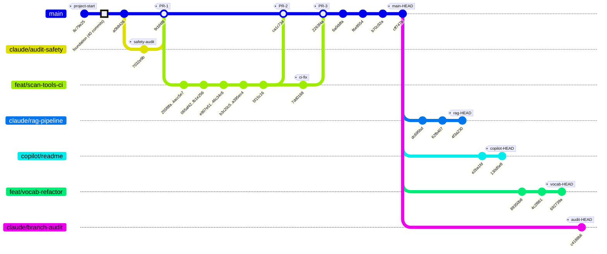
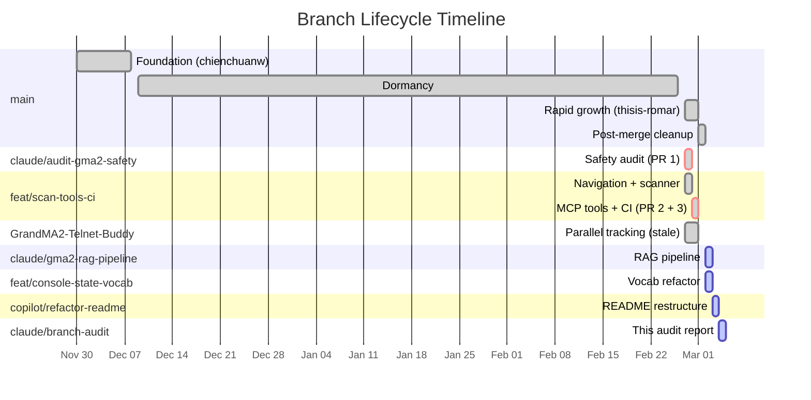
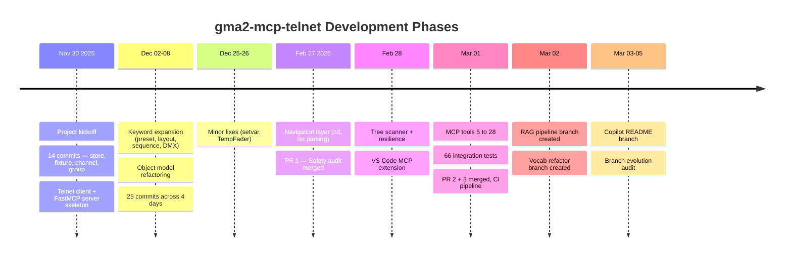

# Branch Evolution Audit Report

## Context

This audit documents the complete branch lifecycle of the **gma2-mcp-telnet** repository — an MCP server for controlling grandMA2 lighting consoles via Telnet. The report maps every branch's relationship to the default branch (`main`), visualizes change progression with timestamps, and identifies development patterns across 78 commits spanning 3 months.

---

## 0. Current Worktree State

```
┌──────────────────────────────────────────────────────────────────┐
│  WORKTREE STATE (as of 2026-03-05)                               │
├──────────────────────────────────────────────────────────────────┤
│  Path     : /home/user/gma2-mcp-telnet                           │
│  Branch   : claude/branch-evolution-audit-WTtXJ                  │
│  HEAD     : c4188b6 docs: add comprehensive branch evolution     │
│  Status   : clean — nothing to commit                            │
│  Tracking : origin/claude/branch-evolution-audit-WTtXJ (up-to-  │
│             date)                                                │
│  Worktrees: 1 (single — no linked worktrees)                     │
└──────────────────────────────────────────────────────────────────┘
```

---

## 1. Repository Overview

| Metric | Value |
|--------|-------|
| Default branch | `main` |
| Total commits (main) | 77 |
| Total commits (all branches) | 88 |
| Total unique branches (all time) | 8 |
| Merged PRs | 3 |
| Active unmerged branches | 4 (including this audit) |
| Fully merged branches | 2 |
| Stale branches | 1 |
| Repository lifespan | 2025-11-30 to 2026-03-05 |
| Contributors | 5 (Chuan/chienchuanw, thisis-romar, Claude, Romar J, copilot-swe-agent) |

---

## 2. Branch Topology — Git Graph

The definitive view of how branches diverge, evolve, and merge relative to `main`.



---

## 3. Branch Lifecycle Timeline

Shows **when** each branch was active and how work overlapped in calendar time.



---

## 4. Development Phases

The narrative arc of the project — what happened in each era.



---

## 5. Commit Density Heatmap

```
2025-11-30  ██████████████  (14)  — Project foundation day
2025-12-02  ████            ( 4)  — Layout/preset keywords
2025-12-03  █               ( 1)  — File refactoring
2025-12-04  █               ( 1)  — Test refactoring
2025-12-06  ███████████     (11)  — Sequence/cue/DMX features
2025-12-08  █████████       ( 9)  — Object model refactor
2025-12-25  █               ( 1)  — Holiday fix
2025-12-26  ██              ( 2)  — Holiday work
             ░░░░░░░░░░░░░░░░░░  — 2-month dormancy
2026-02-27  ████████        ( 8)  — Navigation + safety audit
2026-02-28  ██████████      (10)  — Tree scanner + resilience
2026-03-01  ████████████████(16)  — MCP tools + CI (peak day)
2026-03-02  ████████        ( 8)  — RAG pipeline + vocab refactor
2026-03-03  ██              ( 2)  — Copilot README refactor
2026-03-04  █               ( 1)  — Branch evolution audit
```

---

## 6. Per-Branch Change Summary (vs main)

| Branch | Status | Ahead | Behind | Files | Lines (+/-) |
|--------|--------|-------|--------|-------|-------------|
| `claude/branch-evolution-audit-WTtXJ` | **Active** | 1 | 0 | 1 | +333 / -0 |
| `claude/gma2-rag-pipeline-E2tuR` | **Active** | 3 | 0 | 35 | +2,560 / -37 |
| `copilot/refactor-readme-structure` | **Active** | 2 | 0 | 1 | +110 / -50 |
| `feat/console-state-vocab-refactor` | **Active** | 5 | 0 | 19 | +1,652 / -105 |
| `feat/scan-tools-ci` | Merged | 0 | 7 | — | Fully merged |
| `GrandMA2-Telnet-Buddy` | Stale | 0 | 12 | — | Fully absorbed |

---

## 7. Detailed Branch Profiles

### 7.1 `main` (default branch)

| Property | Value |
|----------|-------|
| Commits | 77 |
| HEAD | `cff747b` — ci: add ruff linting and mypy type checking |
| First commit | `8c79e25` — 2025-11-30 (feat: add store) |
| Latest commit | `cff747b` — 2026-03-01 19:22:01 -0500 |
| Merges received | 3 PRs |

**Development phases on main:**

1. **Foundation** (Nov 30 - Dec 8, 2025) — 40 commits by chienchuanw
   - Command keyword framework (store, fixture, channel, group, etc.)
   - Object model, Telnet client, basic MCP server

2. **Dormancy** (Dec 9, 2025 - Feb 26, 2026) — 3 commits (holiday fixes)

3. **Rapid growth** (Feb 27 - Mar 1, 2026) — 34 commits by thisis-romar + Claude
   - Navigation layer, tree scanner, safety audit
   - MCP expansion (5 to 28 tools), CI/CD, 66 integration tests

---

### 7.2 `claude/audit-gma2-safety-NOqSw` (MERGED — PR #1)

| Property | Value |
|----------|-------|
| Status | **Merged** into main |
| PR | #1 |
| Merge commit | `9cbf4f8` — 2026-02-27 13:16:48 -0500 |
| Unique commits | 1 |
| Author | Claude (AI) |
| Branch deleted | Yes (remote ref removed) |

**Key commit:**
- `7032e9b` — audit: fix security issues, add vocab safety module, clean dead code

**Impact:** Introduced the safety/vocabulary classification system that gates destructive commands.

---

### 7.3 `feat/scan-tools-ci` (MERGED — PR #2 + PR #3)

| Property | Value |
|----------|-------|
| Status | **Merged** into main (twice) |
| PRs | #2 and #3 |
| Merge commits | `ca1c734` (PR#2), `2263f4a` (PR#3) |
| Unique commits | 20 (at time of merge) |
| Active period | 2026-02-27 to 2026-03-01 |
| Author | thisis-romar |

**Commit progression:**

```
Feb 27  Navigation + list parsing (3 commits)
Feb 28  Tree scanner + resilience + VS Code ext (10 commits)
Mar 01  MCP tools 5 to 28, integration tests, CI (7 commits)
        PR#2 merged (ca1c734) with 19 commits
        PR#3 merged (2263f4a) with 1 CI fix commit
```

**Impact:** Largest feature branch. Delivered the tree scanner, all 28 MCP tools, 66 integration tests, and the CI pipeline.

---

### 7.4 `GrandMA2-Telnet-Buddy` (STALE)

| Property | Value |
|----------|-------|
| Status | **Stale** — all commits already in main |
| HEAD | `46c34c6` (ancestor of main HEAD) |
| Unique commits vs main | 0 |
| Last activity | 2026-03-01 15:43:33 |

**Analysis:** This branch points to a commit that is an ancestor of `main`. It appears to have been a parallel tracking branch during active development of `feat/scan-tools-ci`. All its content was absorbed into main via the PR merges. **Candidate for deletion.**

---

### 7.5 `claude/gma2-rag-pipeline-E2tuR` (ACTIVE — unmerged)

| Property | Value |
|----------|-------|
| Status | **Active**, 3 commits ahead of main |
| Fork point | `cff747b` (main HEAD) |
| Created | 2026-03-02 |
| Author | Claude (AI) |
| Files changed | 35 (+2,560 / -37 lines) |

**Unique commits (not in main):**

```
2026-03-02 07:34  dc695bd  feat: add RAG pipeline for dual-source repo indexing and retrieval
2026-03-02 08:28  62fb407  feat: add GitHubModelsProvider for real vector search embeddings
2026-03-02 18:52  4f3a230  docs: refactor README with ToC, collapsible sections, and RAG pipeline docs
```

**Purpose:** Adds a Retrieval-Augmented Generation pipeline for indexing the repository and grandMA2 manual for AI-assisted querying.

---

### 7.6 `copilot/refactor-readme-structure` (ACTIVE — unmerged)

| Property | Value |
|----------|-------|
| Status | **Active**, 2 commits ahead of main |
| Fork point | `cff747b` (main HEAD) |
| Created | 2026-03-03 |
| Author | copilot-swe-agent[bot] |
| Files changed | 1 (+110 / -50 lines) |

**Unique commits (not in main):**

```
2026-03-03 02:22  e2ba1fd  Initial plan
2026-03-03 02:28  130d5e8  refactor README.md: wrap 12 sections in collapsible <details> blocks
```

**Purpose:** AI-agent generated README restructuring with collapsible sections.

---

### 7.7 `feat/console-state-vocab-refactor` (ACTIVE — unmerged)

| Property | Value |
|----------|-------|
| Status | **Active**, 5 commits ahead of main |
| Fork point | `cff747b` (main HEAD) |
| Created | 2026-03-02 |
| Author | thisis-romar |
| Files changed | 19 (+1,652 / -105 lines) |

**Unique commits (not in main):**

```
2026-03-02 18:24  89350b8  fix: correct PRESET_TYPES numbering and server type_map
2026-03-02 18:26  1038829  feat: add live telnet research scripts for console state validation
2026-03-02 18:26  4c2f861  refactor: restructure vocabulary with categorized keywords and Object Keyword metadata
2026-03-02 18:47  0f7b72c  docs: update README for PRESET_TYPES fix, vocab refactor, and research scripts
2026-03-02 18:52  692739a  chore: add mcp[cli] dev dependency, launch config, and command-builders doc
```

**Purpose:** Major vocabulary system refactor with categorized keywords, object metadata, and bug fix for preset types.

---

### 7.8 `claude/branch-evolution-audit-WTtXJ` (ACTIVE — this report)

| Property | Value |
|----------|-------|
| Status | **Active**, 1 commit ahead of main |
| Fork point | `cff747b` (main HEAD) |
| Created | 2026-03-04 |
| Author | Claude (AI) |
| Files changed | 1 (+333 / -0 lines) |

**Unique commits (not in main):**

```
2026-03-04 16:35  c4188b6  docs: add comprehensive branch evolution audit report
```

---

## 8. Contributor Analysis

| Author | Commits | Period | Role |
|--------|---------|--------|------|
| Chuan (home) / chienchuanw | 43 | Nov-Dec 2025 | Original author — foundation |
| thisis-romar | 31 | Feb-Mar 2026 | Lead developer — MCP tools, scanner, CI |
| Claude (AI) | 8 | Feb-Mar 2026 | Safety audit, RAG pipeline, navigation |
| Romar J | 3 | Feb-Mar 2026 | PR merge commits |
| copilot-swe-agent[bot] | 2 | Mar 2026 | README refactoring |

---

## 9. Merge and PR History

```
PR #1  claude/audit-gma2-safety-NOqSw  -->  main
       Merged: 2026-02-27 13:16:48
       Commits: 1
       Merge commit: 9cbf4f8

PR #2  feat/scan-tools-ci  -->  main
       Merged: 2026-03-01 18:45:48
       Commits: 19
       Merge commit: ca1c734

PR #3  feat/scan-tools-ci  -->  main
       Merged: 2026-03-01 18:48:30
       Commits: 1 (CI fix after PR#2)
       Merge commit: 2263f4a
```

---

## 10. Branch Health Summary

| Branch | Status | Ahead | Behind | Action Recommended |
|--------|--------|-------|--------|--------------------|
| `main` | Default | — | — | — |
| `claude/audit-gma2-safety-NOqSw` | Merged | 0 | 0 | Already deleted |
| `feat/scan-tools-ci` | Merged | 0 | 0 | Delete remote ref |
| `GrandMA2-Telnet-Buddy` | Stale | 0 | 12 | **Delete** — fully absorbed |
| `claude/gma2-rag-pipeline-E2tuR` | Active | 3 | 0 | Review for merge |
| `copilot/refactor-readme-structure` | Active | 2 | 0 | Review for merge |
| `feat/console-state-vocab-refactor` | Active | 5 | 0 | Review for merge |
| `claude/branch-evolution-audit-WTtXJ` | Active | 1 | 0 | Merge after review |

---

## 11. Full Commit Graph (all branches)

The raw `git log --all --graph` output — the definitive record of every commit and branch relationship.

```
* c4188b6 2026-03-04 docs: add comprehensive branch evolution audit report (HEAD -> claude/branch-evolution-audit-WTtXJ, origin/claude/branch-evolution-audit-WTtXJ)
| * 130d5e8 2026-03-03 refactor README.md: wrap 12 sections in collapsible <details> blocks (origin/copilot/refactor-readme-structure)
| * e2ba1fd 2026-03-03 Initial plan
|/
| * 692739a 2026-03-02 chore: add mcp[cli] dev dependency, launch config, and command-builders doc (origin/feat/console-state-vocab-refactor)
| * 0f7b72c 2026-03-02 docs: update README for PRESET_TYPES fix, vocab refactor, and research scripts
| * 4c2f861 2026-03-02 refactor: restructure vocabulary with categorized keywords and Object Keyword metadata
| * 1038829 2026-03-02 feat: add live telnet research scripts for console state validation
| * 89350b8 2026-03-02 fix: correct PRESET_TYPES numbering and server type_map
|/
| * 4f3a230 2026-03-02 docs: refactor README with ToC, collapsible sections, and RAG pipeline docs (origin/claude/gma2-rag-pipeline-E2tuR)
| * 62fb407 2026-03-02 feat: add GitHubModelsProvider for real vector search embeddings
| * dc695bd 2026-03-02 feat: add RAG pipeline for dual-source repo indexing and retrieval
|/
* cff747b 2026-03-01 ci: add ruff linting and mypy type checking (origin/main, master)
* b70c92a 2026-03-01 chore: add Apache 2.0 license, fix README, complete pyproject.toml
* f6e9554 2026-03-01 refactor: move debug scripts to scripts/ and root tests to tests/
* 6a0ddfa 2026-03-01 chore: remove data dumps from git and update .gitignore
*   2263f4a 2026-03-01 Merge pull request #3 from thisis-romar/feat/scan-tools-ci
|\
| * 7dd0168 2026-03-01 fix(ci): exclude live integration tests that require a console connection (origin/feat/scan-tools-ci)
* | ca1c734 2026-03-01 Merge pull request #2 from thisis-romar/feat/scan-tools-ci
|\|
| * 5f15c16 2026-03-01 docs: add YAML front matter to CLAUDE.md and vscode-mcp-provider/README.md
| * a395ec4 2026-03-01 feat: add 66 live integration tests validating all 28 MCP tools against real console
| * c8844f6 2026-03-01 feat: add 8 composite MCP tools (20 to 28 total), covering 32 command builders
| * b3c20c5 2026-03-01 feat: add 7 MCP tools, navigation tests, and CI workflow
| * 46c34c6 2026-03-01 feat: Phase 3 — structured error handling and 23 new MCP tool tests (origin/GrandMA2-Telnet-Buddy)
| * 6ed6aac 2026-03-01 docs: update README for 13 tools, safety gate, and GMA_SAFETY_LEVEL
| * 73b0f05 2026-03-01 feat: add 5 core lighting MCP tools
| * 84c0978 2026-03-01 feat: safety gate, property setter tool, and input sanitization
| * e907e51 2026-03-01 feat: column parsing, leaf-shortcut optimization, and scanner resilience
| * e138cf5 2026-02-28 docs: add tree scanner, VS Code extension, and utility scripts to README
| * 7250fa7 2026-02-28 feat: add VS Code MCP provider extension for grandMA2 server
| * 4c48d6a 2026-02-28 test: add scan log parsers and telnet debugging utilities
| * ed692b0 2026-02-28 data: add scan output snapshots and telnet session logs
| * 25a26b6 2026-02-28 chore: add Claude Code local permission settings
| * 6f9214f 2026-02-28 chore: add node_modules and dist to .gitignore
| * fb1e256 2026-02-28 perf: scanner speed and resilience optimizations for full-depth scans
| * f8707a1 2026-02-28 perf: tune scanner speed — reduce delay/timeout defaults
| * 401241b 2026-02-28 fix: add telnet reconnect logic to prevent scanner hangs
| * 065af42 2026-02-28 feat: full-depth tree scanner with duplicate detection and SubForm fix
| * 8a27f7e 2026-02-27 fix: root list parser, depth-limited scanner with flat-branch optimization
| * 1cb7c54 2026-02-27 fix: strip ANSI codes and parse real MA2 tabular list format
| * 641055e 2026-02-27 refactor: update README for navigation, prompt parsing, and 6 MCP tools
| * 3fdc842 2026-02-27 feat: add dot-notation cd syntax and list command parsing
| * 4acc5e7 2026-02-27 feat: add ChangeDest (cd) navigation with telnet prompt parsing
| * 255f8fa 2026-02-27 refactor: rewrite README and fix hardcoded IP in Makefile
* | 9cbf4f8 2026-02-27 Merge pull request #1 from thisis-romar/claude/audit-gma2-safety-NOqSw
|\|
| * 7032e9b 2026-02-27 audit: fix security issues, add vocab safety module, clean dead code
|/
* a0b8426 2025-12-26 modify: TempFader
* 9d6bdcb 2025-12-26 feat: empty keyword
* e913848 2025-12-25 feat: add setvar, setuservar, addvar, adduservar
* 51c5a70 2025-12-08 feat: add Call keyword
* 2cf32b9 2025-12-08 modify: update Feature keyword
* 629e945 2025-12-08 feat: add Attribute
* 6ff9f51 2025-12-08 feat: add Park and Unpark
* fc3c1a9 2025-12-08 feat: add And keyword
* 1e9ca12 2025-12-08 modify: implement plus and minus
* 7fe6548 2025-12-08 feat: create plus and minus tests
* 8f1839e 2025-12-08 chore: translate to English
* 67e02a2 2025-12-08 refactor: separate objects.py into individual files
* 7da3cee 2025-12-06 doc: update README.md
* 7f797fa 2025-12-06 feat: add cut and paste
* ea97544 2025-12-06 feat: timecode, timecodeslot, timer
* 8b59ff8 2025-12-06 feat: add edit keyword
* 3778b76 2025-12-06 feat: Dmx and DmxUniverse
* c2385d9 2025-12-06 feat: sequence, cue, part
* 7e2eefb 2025-12-06 doc: update README.md
* 2144334 2025-12-06 chore: update more translation
* b98d7f8 2025-12-06 chore: translate functions from Chinese to English
* 4493b62 2025-12-06 feat: goback, goto, go
* e1e34c2 2025-12-06 feat: add defgoback, defgoforward, defgopause
* 6ee5710 2025-12-04 refactor: separate test_commands.py into smaller files
* 8d0eebf 2025-12-03 refactor: separate functions.py into smaller files
* de02e63 2025-12-02 feat: add <<< and >>> keywords
* 0c384ac 2025-12-02 feat: add presettype keyword
* 3906792 2025-12-02 feat: add preset keyword
* 4802b52 2025-12-02 feat: add layout keyword
* 5ed5c49 2025-11-30 modify: allow mcp to read feedback from telnet
* be973bf 2025-11-30 feat: add list and info
* 4a14723 2025-11-30 feat: add delete and remove
* 92dbc8b 2025-11-30 fix: use async and await to follow the rules of FastMCP
* 4d3e9da 2025-11-30 fix: reslove wrong type issue
* 2a1fea3 2025-11-30 chore: translate comments to English
* fed27c6 2025-11-30 modify: replace telnetlib with telnetlib3 to resolve deprecated issue
* b18c633 2025-11-30 feat: add assign, label, appearance
* 468973d 2025-11-30 feat: add copy and move
* b7367a0 2025-11-30 feat: add at and @ (at)
* 1466dd9 2025-11-30 refactor: separate commands into constants, functions, helpers, objects and update README
* b08e737 2025-11-30 refactor: categorize MA2 keywords
* 6a7f18c 2025-11-30 feat: add fixture, channel, group
* 8c79e25 2025-11-30 feat: add store (grafted)
```

---

## 12. Key Findings

1. **All active branches fork from the same point** (`cff747b`, current main HEAD). No branch is behind main — there are zero merge conflicts pending from drift.

2. **Two branches are candidates for cleanup:** `GrandMA2-Telnet-Buddy` (stale, 0 unique commits) and `feat/scan-tools-ci` (fully merged).

3. **Four active branches contain meaningful unmerged work** totaling 11 commits and ~4,600 lines of additions.

4. **Development ownership transitioned** from chienchuanw (Nov-Dec 2025) to thisis-romar (Feb-Mar 2026), with AI agents (Claude, Copilot) contributing 10 of 88 total commits (11.4%).

5. **Peak activity day:** 2026-03-01 with 16 commits — the MCP tools expansion and CI setup day.

6. **Shallow clone detected:** The earliest commit (`8c79e25`) is grafted, meaning full history may extend further back.

7. **No release tags exist:** The repository has no semantic versioning or release markers despite having 77 commits and a functioning CI pipeline.
